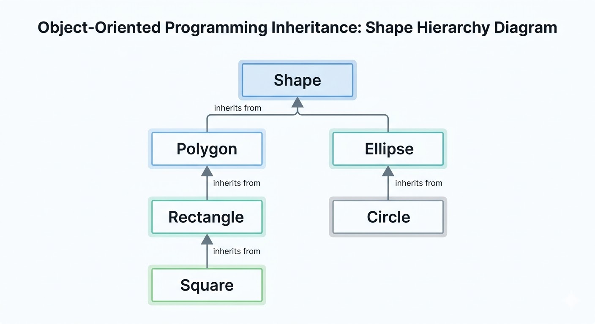
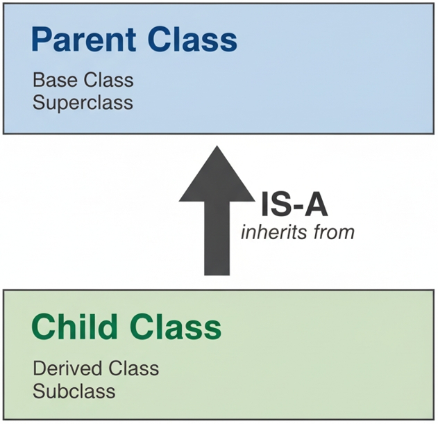

# Intro to inheritance

## Intro to inheritance: Shapes
You want to build a software drawing various **2D Shapes**: Rectangle, Square, Polygon, Circle, Ellipse, etc.

::: {.fragment}
- You can decide to build each class representing each particular shape. But you recognize "Wait a minute":

  - A `Square` [is a]{style="color:red"} `Rectangle`
  - A `Rectangle` [is a]{style="color:red"} `Polygon`
  - A `Circle` [is a]{style="color:red"} `ELlipse`
  - All of them is a `Shape`
  
- Furthore, we notice
  - A `Polygon` [has a]{style="color:red"} list of `Point2D`
  - A `Ellipse` [has a]{style="color:red"} center of `Point2D` and [has two]{style="color:red"} two axis sizes `a` and `b` of type `double`.
  - A `Circle` is similiar to `Ellipse` but `a == b`.
  - A `Rectangle` [has a]{style="color:red"} has a corner of `Point2D` and two sizes `a` and `b` of type `double`
  - A `Square` is similar to a `Rectangle` but `a == b`.
:::

## Intro to inheritance: Shapes

- You notice that

  - Drawing a square should be a consequence of drawing a rectangle with the same size.
  - Drawing a rectangle should be a consequence of drawing a "special" polygon of 4 sides.
  - Drawing a circle should be a consequence of drawing an ellipse

So why do we bother to build different classes separately!

## Hierarchies

A hierarchy is a diagram showing how various objects are related.



## Intro to inheritance: University People

If the above example cannot convince you enough, look at our University hierarchy.

:::{.fragment}
**A very small description about roles in our Uni**

- Every member of staffs [has a]{style="color:red"} `name`, a `birthday`, an `ID`
- Every student [has a]{style="color:red"} `name`, a `birthday`, an `ID`
- There are different types of staff members: `Lecturer`, `TOMember`, `Demonstrator`, `SecurityGuard`
- There are different types of students: `UGStudent` (undergraduate), `PGTStudent` (Post-graduate Taught) and `PGRStudent` (Post-graduate Research)
- Every person in the Uni has their role and knows their role, work on their role.
:::

:::{.fragment}
&#10149;&nbsp; If you are about to create all the classes `Lecturer`, `TOMember`, `Demonstrator`, `SecurityGuard`, `UGStudent`, `PGTStudent`, `PGRStudent`, you see that you must [*plug figure here*] a lot for common data members and member functions.


{width=30%}

:::


::: {.fragment}
This violates the principle designing rule: [**Do not repeat yourself**]{style="color:red"}
:::

## Intro to inheritance: How about the following design hierarchy

```{mermaid}
%%| echo: false
classDiagram
    direction TD
    %% Person is an abstract base class
    class Person {
        <<Abstract>>
        -name: String
        -birthday: Date
        -ID: Integer
        +knowRole() String
    }

    %% StaffMember inherits from Person
    class StaffMember {
        <<Abstract>>
        +workOnRole() 
    }
    Person <|-- StaffMember : inherits from

    %% Specific Staff Roles
    class Lecturer {
        +teach() 
        +mark() 
    }
    class TOMember {
        +organizeTimeTable() 
        +processGrades() 
    }
    class Demonstrator {
        +assist() 
        +provideFB() 
    }
    class SecurityGuard {
        +assist() 
        +checkSafety() 
    }

    StaffMember <|-- Lecturer : implements
    StaffMember <|-- TOMember : implements
    StaffMember <|-- Demonstrator : implements
    StaffMember <|-- SecurityGuard : implements

    %% Student inherits from Person
    class Student {
        <<Abstract>>
        +workOnRole() 
    }
    Person <|-- Student : inherits from

    %% Specific Student Roles
    class UGStudent {
        +writeBScThesis()
    }
    class PGTStudent {
        +writeMScThesis()
    }
    class PGRStudent {
        +writePhDTHesis()
    }

    Student <|-- UGStudent : implements
    Student <|-- PGTStudent : implements
    Student <|-- PGRStudent : implements

    %% Styling (Optional but helpful)
    style Person fill:#f9f,stroke:#333,stroke-width:2px
    style StaffMember fill:#bbf,stroke:#333
    style Student fill:#bfb,stroke:#333
    style Lecturer fill:#ddd,stroke:#333
    style UGStudent fill:#ddd,stroke:#333
```

# Basic inheritance in C++

## Terminilogies


## Terminilogy

&#9998;&nbsp; In an inheritance (is-a) relationship

- the class being inherited from: [**parent class**]{style="color:red"}, [**base class**]{style="color:red"}, or [**superclass**]{style="color:red"}
- the class doing the inheriting: [**child class**]{style="color:red"}, [**derived class**]{style="color:red"}, or [**subclass**]{style="color:red"}



## Basic inheritance in C++: Mini example

&#10149;&nbsp; We will adopt a smaller design structure:

- Every `Lecturer` [is a]{style="color:red"} a `UniPerson`
- Every `Student` [is a]{style="color:red"} a `UniPerson`
- Every `Lecturer` and `Student` has `name` and `ID`.

We shall discuss 
- `work_on_role()` later when we study [**Polymorphism**]{style="color:red"} and [**Virtual Function**]{style="color:red"}.
- other member functions in `Lecturer` and `Student` when we study [_adding more functionality_] to child class.


## Basic inheritance in C++: Mini-diagram for code demonstration
```{mermaid}
%%| echo: false
classDiagram
    direction LR
    %% Person is an abstract base class
    class UniPerson {
        -name std::string
        -ID int
        -age int
        +get_name() std::string 
        +get_ID() int
        +get_age() int
    }
    %% class UniPerson
    %% UniPerson : -name string
    %% UniPerson : -ID int
    %% UniPerson : -age int

  

    %% Specific Staff Roles
    class Lecturer {
        - salary: double
        + get_salary() double
    }

    UniPerson <|-- Lecturer : inherits from

    %% Student inherits from Person
    class Student {
        -tuition_fee: double
        +get_tuition() double
    }
    UniPerson <|-- Student : inherits from


    %% Styling (Optional but helpful)
    %% style Person fill:#f9f,stroke:#333,stroke-width:2px
    %% style Student fill:#bfb,stroke:#333
    %% style Lecturer fill:#ddd,stroke:#333
```

## Implementation of Inheritance: class `UniPerson`

&#10149;&nbsp; Let us look at the class `UniPerson`

::: {#lst-class-uni-person lst-cap="class `UniPerson`. Filename=`uniperson.cpp`"}
```{.cpp}

```
:::

## Implementation of Inheritance: class `Lecturer` without inheritance

::: {#lst-class-lecturer-without-inheritance lst-cap="class `Lecturer` without inheritance. Filename=`lecturer_noinheritance.cpp`"}
```{.cpp}

```
:::

&#10149;&nbsp; **Question** Can you tell me what problem we have?

## Implementation: class `Lecturer` inherited from class `UniPerson`

::: {#lst-class-lecturer-with-inheritance lst-cap="class `Lecturer` inherited from class `UniPerson`. Filename=`lecturer.h`"}
```{.cpp}

```
:::

## Impelemntation: Put two classes together into a `main` program


::: {#lst-main-uniperson-lecturer lst-cap="A program using class `Lecturer` derived from the class `UniPerson` Filename=`main_uniperson_lecturer.cpp`"}
```{.cpp}

```
:::

&#10149;&nbsp; **Notice** that we can access `age`, `id` members although we did not define them explicitly in class `Lecturer`. _Let us run the code._

## Implementation: class `Student`

&#10149;&nbsp; It is now easy to write class `Student` derived from `UniPerson`

::: {#lst-class-student lst-cap="class `Student` inherited from the class `UniPerson` Filename=`student.h`"}
```{.cpp}

```
:::

## Implementation: Put three classes together into a `main` program


::: {#lst-main-uniperson-lecturer-student lst-cap="A program using classes `Lecturer` and `Student` derived from the class `UniPerson` Filename=`main_uniperson_lecturer_student.cpp`"}
```{.cpp}

```
:::

## Inheritance chains

&#9998;&nbsp; We can comeback to our bigger diagram

`UGStudent`, `PGTStudent` and `PGRStudent` are all derived from class `Student` and thus we have [**inherintance chain**]{style="color:red"}

```{mermaid}
%%| echo: false
classDiagram
    %% Person is an abstract base class
    class UniPerson {
    }
    class Lecturer {
    }
    class Student {
    }
    UniPerson <|-- Student : inherits from
    class PGTStudent {
    }
    class UGStudent {
    }

    UniPerson <|-- Lecturer : inherits from
    Student <|-- UGStudent: inherits from
    Student <|-- PGTStudent: inherits from
    Student <|-- PGRStudent: inherits from
    %% Styling (Optional but helpful)
    style UniPerson fill:#f9f,stroke:#333,stroke-width:2px
    style Student fill:#bfb,stroke:#333
    style Lecturer fill:#ddd,stroke:#333
```

&#10149;&nbsp; We will write a class for `UGStudent`. 

&#10149;&nbsp; Instead of writing everything all the classes in one single giant filet, let us do this in multiple header files, which is the next topic.

# Split the program into header files and implementation files

## Goals of this example

:::{.fragment}
&#9998;&nbsp; We go through the steps that need to be done to build a program that needs implementation of many classes.

- Write header files (`filename.h` or `filename.hpp`) for each class
- Write implementation files (`filename.cpp`) for the corresponding class
- Compile the main program using the `.cpp` files.
:::

::: {.fragment}
We build four classes and one main program. Each class is done by one header file `.h` and one implementation file `.cpp`:

- class `UniPerson`
- class `Lecturer` inherits from `UniPerson`
- class `Student` inherits from `UniPerson`
- class `UGStudent` inherits from `Student`
:::

## class `UniPerson`: Header file

::: {#lst-header-file-uniperson lst-cap="Header file for class `UniPerson` Filename=`uni-program/uniperson.h`"}
```{.cpp}

```
:::

## class `UniPerson`: Implementation file

::: {#lst-implementation-file-uniperson lst-cap="Implementation file for class `UniPerson` Filename=`uni-program/uniperson.cpp`"}
```{.cpp}

```
:::

## class `Lecturer`: Header file

::: {#lst-header-file-lecturer lst-cap="Header file for class `Lecturer` Filename=`uni-program/lecturer.h`"}
```{.cpp}

```
:::

## class `Lecturer`: Implementation file

::: {#lst-implementation-file-lecturer lst-cap="Implementation file for class `Lecturer` Filename=`uni-program/lecturer.cpp`"}
```{.cpp}

```
:::

## class `Student`: Header file

::: {#lst-header-file-student lst-cap="Header file for class `Student` Filename=`uni-program/student.h`"}
```{.cpp}

```
:::

## class `Student`: Implementation file

::: {#lst-implementation-file-student lst-cap="Implementation file for class `Student` Filename=`uni-program/student.cpp`"}
```{.cpp}

```
:::

## class `UGStudent`: Header file

::: {#lst-header-file-ugstudent lst-cap="Header file for class `UGStudent` Filename=`uni-program/ugstudent.h`"}
```{.cpp}

```
:::

## class `UGStudent`: Implementation file

::: {#lst-implementation-file-ugstudent lst-cap="Implementation file for class `UGStudent` Filename=`uni-program/ugstudent.cpp`"}
```{.cpp}

```
:::

# Order of construction of derived classes

In this lesson, we take a closer look at the order of construction that happens when a derived class is instantiated.

## Order of constructors

&#10149;&nbsp; Let us look at this simple code involving two classes

::: {#lst-parent-and-child lst-cap="Two simple classes `Parent` and `Child` which inherits from `Parent`. Filename=`parent_and_child.cpp`"}
```{.cpp}

```
:::

## Order of construction of derived classes: Diagram

The diagram of the above code snippet is easy:

```{mermaid}
%%| echo: false
classDiagram
    direction TD
    class Parent {
        -parent_value double
        +get_parent_value() double
    }

    class Child {
        -child_value double
        +get_child_value() double
    }

    Parent <|-- Child

    %% Styling (Optional but helpful)
    style Parent fill:#f9f,stroke:#333,stroke-width:2px
    style Child fill:#bbf,stroke:#333
```

&#9998;&nbsp; The members of `Parent` are **not** copied into `Child`.

&#9998;&nbsp; Instead, we can consider `Child` and `Parent` as a two-part class: one part `Child` + one part `Parent`

## Order of construction of derived classes: A closer look

::: {#lst-parent-and-child-main lst-cap="The constructor of the `Parent` class is executed before the constructor of the `Child` class. Filename=`parent_and_child_with_main.cpp`"}
```{.cpp}

```
:::

&#10149;&nbsp; The constructor of `Parent` class is executed before the constructor of `Child` class is excuted when a `Child` object is created.

## Order of construction for inheritance chains

&#10149;&nbsp; Let us look at this example

```{mermaid}
%%| echo: false
classDiagram
    direction LR
    class A {
    }

    class B {
    }

    class C {
    }

    class D {
    }

    A <|-- B
    B <|-- C
    C <|-- D

    %% Styling (Optional but helpful)
    style A fill:#f9f,stroke:#333,stroke-width:2px
    style B fill:#bbf,stroke:#333
    style C fill:#bbf,stroke:#333
    style D fill:#bbf,stroke:#333
```

**Question** If I create an object of class `D`, what would you expect to be executed?

:::{.fragment}
&#9998; The above idea/knowledge applies naturally to **inheritance chains**: 

- the great grandparent `A` constructor is executed, **then** 
- the grandparent `B` constructed is executed, **then** 
- the parent `C` constructor is executed, and **then** 
- the child `D` constructor is executed.
:::

## Order of construction for inheritance chains: Code demonstration

::: {#lst-inheritance-chain-construction-order lst-cap="Order of construction of derived classes in an inheritance chain. Filename=`inheritance_chain_four_classes.cpp`"}
```{.cpp}

```
:::
[source-code](./cpp/inheritance_chain_four_classes.cpp)


# Constructors and initialization of derived classes

&#9998;&nbsp; In Python, we can use `super()` to access the parent's data and member functions.

&#9998;&nbsp; Thus, we can write `super().__init__(self,...)` to use the constructor of the parent class.

```{python}
class UniPerson:
    
    nextID = 10000  # class variable

    def __init__(self, name="", age=18):
        self.name, self.age = name, age
        self.id = UniPerson.nextID
        UniPerson.nextID += 1
class Lecturer(UniPerson):
    def __init__(self, name="", age=18):
        super().__init__(name, age)
        print(f"Lecturer {self.name} is recruited.")
```

&#10149;&nbsp; This will be the topic of this lesson.


## Revisit Python example

```{python}
class UniPerson:
    nextID = 10000  # class variable, functioning like static int nextID in C++
    def __init__(self, name="", age=18):
        self.name, self.age = name, age
        self.id = UniPerson.nextID; UniPerson.nextID += 1   # fit into the slide
class Lecturer(UniPerson):
    def __init__(self, name="", age=18):
        super().__init__(name, age)
        print(f"Lecturer {self.name} is recruited.")
    def __str__(self):      # print out the name of the lecturer
        return self.name

khiem = Lecturer("Khiem", 42)
print(f"ID assigned for {khiem}: {khiem.id}")
```

## Initialization involving inheritance: A problem example

&#10149;&nbsp; Look at this simple example

::: {#lst-initialization-of-derived-classes lst-cap="An example illustrating the initialization process of a derived class. Filename=`initialization_of_derived_class.cpp`"}
```{.cpp}

```
:::

## Initialization: Looking at `Parent` class

```{.cpp}
Parent parent{ 42 };
```

What happens when `Parent` is instantiated:

- Memory for base class (`Parent`) is set aside.
- Appropriate `Parent` constructor is called.
- Member initializer list initializes variables
- Body of constructor executes.
- Control is returned to the caller.

## Initialization: Looking at `Child` class

```{.cpp}
Parent child{ 42.24 };
```

What happens when `Child` is instantiated:

- Memory for derived class (`Child`) is set aside.
- Appropriate `Child` constructor is called.
- [*`Parent` object is constructed first using the pappropriate `Parent` constructor*]{style="color:red"}. If no parent constructor is specified, the default constructor will be used.
- Member initializer list initializes variables.
- Body of the constructor executes.
- Control is returned to the caller.

**Question** 

- How about the `id` member that a `Child` object inherits from `Parent`? 
- How can we initialize it when we create an object of `Child` class.

